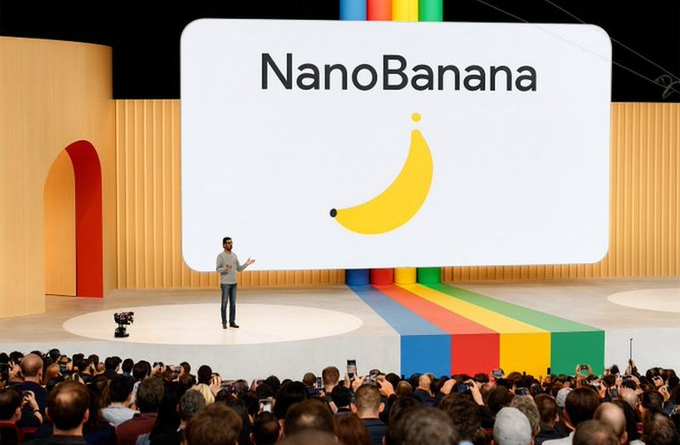
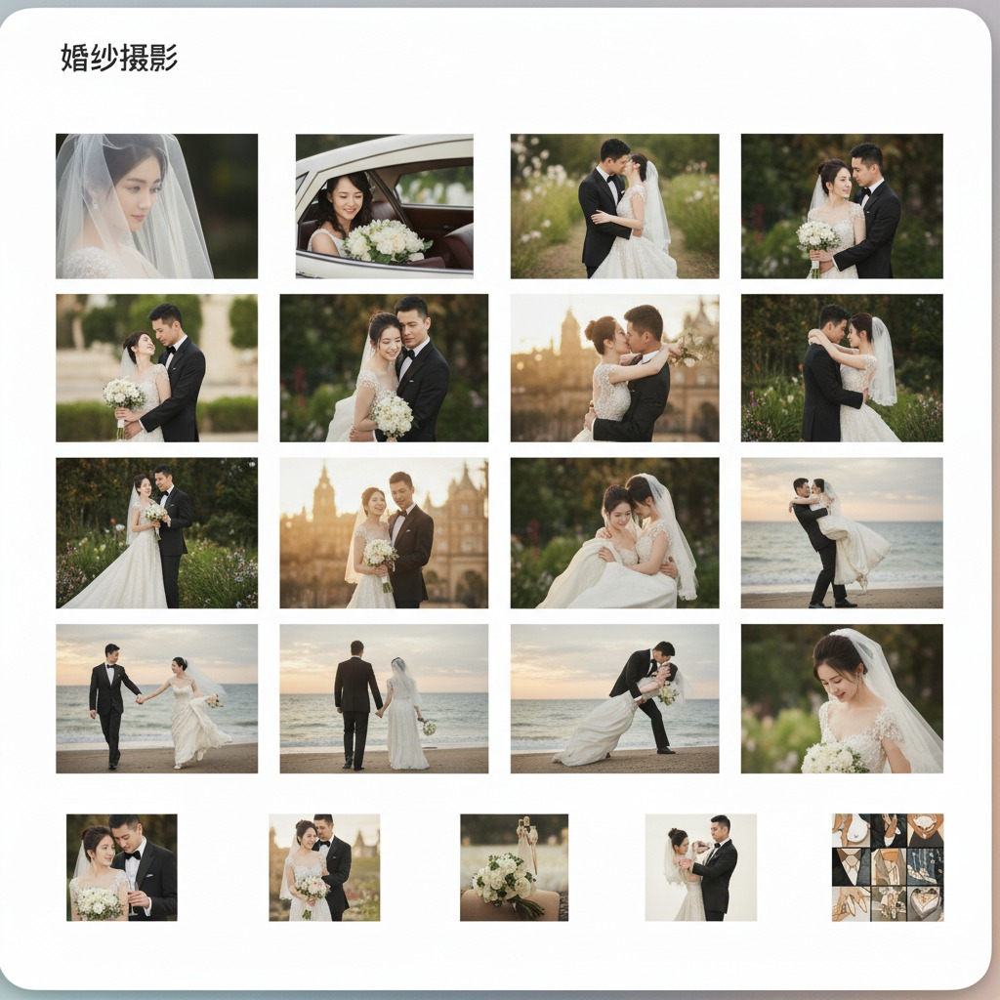
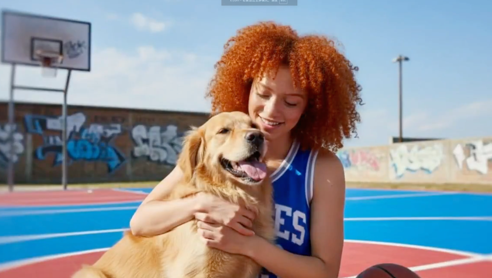
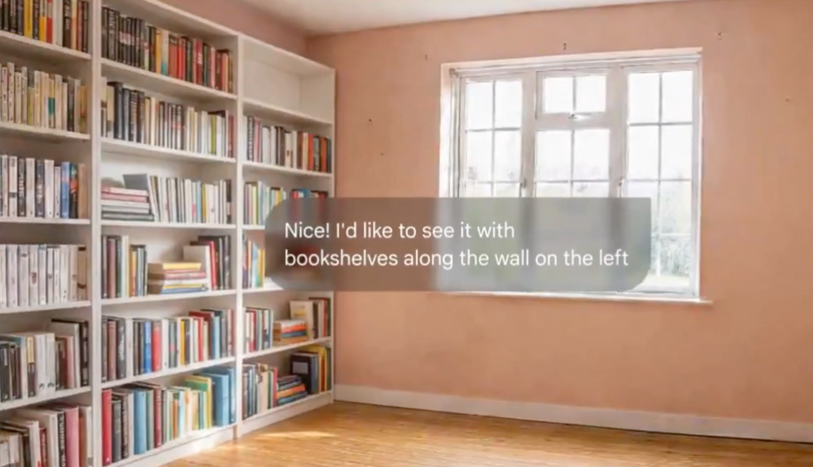
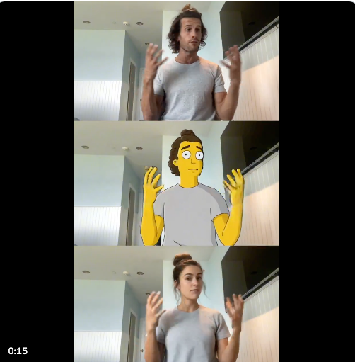
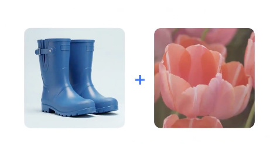
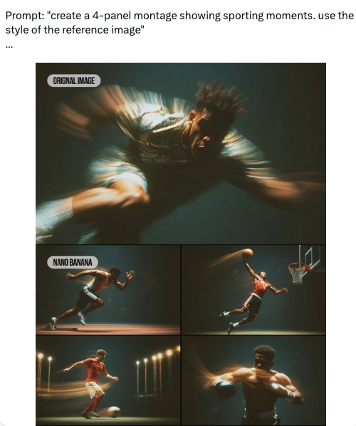

# Awesome Gemini-Nano-Banana - A Collection of Awesome Use Cases

[](http://makeapullrequest.com)

A curated list of awesome applications, best practices, and resources for the Gemini-Nano-Banana model, driven by the community.

English | [中文](./README.md)

---

`gemini-nano-banana` is the latest high-efficiency image model from Google, excelling in generation quality, speed, and understanding complex instructions. This project aims to collect and showcase its practical use cases to inspire more creativity.


## Table of Contents

- [✨ Showcase](#-showcase)
- [🛠️ How to Use](#️-how-to-use)
  - [API Call Example](#api-call-example)
  - [Command Line Tool](#command-line-tool)
- [💡 Application Scenarios](#-application-scenarios)
- [📚 Resources & Tools](#-resources--tools)
- [🤝 How to Contribute](#-how-to-contribute)
- [📜 License](#-license)

## ✨ Showcase

*Here we display some of the most stunning and representative images to attract visitors with a strong visual impact.*

| Category | Prompt | Output | Source |
| :--- | :--- | :--- | :--- |
| **Character Figure** | `turn this photo into a character figure. Behind it, place a box with the character’s image printed on it, and a computer showing the Blender modeling process on its screen. In front of the box, add a round plastic base with the character figure standing on it. Make the PVC material look clear, and set the scene indoors if possible.` |   | [Xilisen] |
| **Product Rendering** | `A model is posing and leaning against a pink bmw. She is wearing the following items, the scene is against a light grey background. The green alien is a keychain and it's attached to the pink handbag. The model also has a pink parrot on her shoulder. There is a pug sitting next to her wearing a pink collar and gold headphones.` |   | [ravis Davids] |
| **Mixed Reality** | `what does the red arrow see` |  | [Eyisha Zyer] |
| **Action Reference** | `make it real` |  | [nic] |
| **Text Dance** | `Generate a dance routine based on Chinese character postures, using them as a reference.` |  | [Guicang] |


*(For more amazing examples, please check the [Showcase Directory](./showcase/)).*

## 💡 Application Scenarios

**1. Combine photos into new scenes**
   - **Description**: Seamlessly merge multiple independent photos into a brand new, imaginative scene. For example, you can combine a photo of your friend with a photo of the moon's surface to generate an image of "a friend walking on the moon." The model will automatically handle lighting, shadows, and perspective to make the result look seamless.

    
> Source: [Eyisha Zyer]

**2. Edit image by describing to it**
   - **Description**: Use natural language to directly "command" the model to modify an image. No need for complex photo editing software; just tell it "put sunglasses on this girl" or "change the sky to the style of Van Gogh's Starry Night," and the model will understand and execute your instructions.

   
> Source: [Eyisha Zyer]

**3. AI Video Stream (Nano Banana + Runway Act 2)**
   - **Description**: This is a powerful workflow. First, use Nano Banana to generate a high-quality static image (e.g., a keyframe of a futuristic city), then import it into a video generation tool like Runway Act 2 to bring the static image to life, greatly simplifying the animation and video creation process.
   
> Source: [Techguyver]


**4. Start frames for Ads**
   - **Description**: Quickly generate a large number of "starting frames" or "concept images" in different styles and with different creative ideas in the early stages of ad production. This helps creative teams visualize ideas in minutes for proposals and selection, greatly improving efficiency.
   
> Source: [Mike Futia]

**5. Move styles from one image to another**
   - **Description**: Apply the artistic style of one image (e.g., watercolor, oil painting, cyberpunk) to the content of another. You can easily turn an ordinary street scene photo into a masterpiece full of artistic sense.
   
    
> Source: [Eyisha Zyer]

**6. Change text**
   - **Description**: Intelligently recognize and modify the text content in an image. For example, you can easily change "Summer Sale" on a poster to "Autumn New Arrivals," and the model will automatically match the original font, color, and lighting effects.
   
> Source: [Eyisha Zyer]

**7. Restore or fix old and blurry photos**
   - **Description**: Repair old photos that are scratched, blurry, or have low resolution. The model can intelligently "imagine" the missing details, improve clarity, and even colorize black and white photos, bringing precious memories back to life.
   
> Source: [Source needed]

**8. Change image background**
   - **Description**: Easily change the background of any image's subject. Whether it's changing the background color for an ID photo or generating diverse display environments for product images, it can be done with one click, and the edges are handled very naturally.

> Source: [Marouane Lamharzi Alaoui]

**9. A new era of indie anime animators**
   - **Description**: Empower independent animation and manga creators. By generating character designs, scene concept art, keyframe animations, etc., it greatly reduces the barrier to entry and cost of creation, allowing a single person or a small team to create high-quality anime works.

> Source: [tapehead.lab]

**10. Create new images in the same style from a reference photo**
    - **Description**: Provide a reference image and let the model "learn" its unique style (including art style, color tone, brushstrokes, etc.), then use this style to generate brand new images with different content. This is crucial for creating series of illustrations, game assets, or maintaining brand visual consistency.
    
> Source: [Source needed]

## 🛠️ How to Use

There are two main ways to experience the power of Gemini-Nano-Banana:

### 1. Gemini AI Studio (Chatbox)

This is the easiest and fastest way, requiring no programming knowledge.

- **Entry**: Visit [Gemini AI Studio](https://aistudio.google.com/)
- **Steps**:
  1. Directly enter your image generation instructions (Prompt) in the chatbox.
  2. You can also upload an image and then enter instructions to have the model edit or transform the image.
  3. Click generate to see the results on the right side of the interface.


### 2. Google API Access (Code Example)

If you are a developer and want to integrate the model's capabilities into your own application, you can use the API.
https://github.com/nickylin/how-to-use-gemini-nano-banana

# To run this code you need to install the following dependencies:
# pip install google-genai
```
import base64
import mimetypes
import os
from google import genai
from google.genai import types


def save_binary_file(file_name, data):
    f = open(file_name, "wb")
    f.write(data)
    f.close()
    print(f"File saved to to: {file_name}")


def generate():
    client = genai.Client(
        api_key=os.environ.get("GEMINI_API_KEY"),
    )

    model = "gemini-2.5-flash-image-preview"
    contents = [
        types.Content(
            role="user",
            parts=[
                types.Part.from_text(text="""Generate an image of a banana wearing a costume."""),
            ],
        ),
        types.Content(
            role="model",
            parts=[
                types.Part.from_text(text="""Okay, here is a banana wearing a costume for you: """),
                types.Part.from_bytes(
                    mime_type="image/png",
                    data=base64.b64decode(
                        """base64image"""
                    ),
                ),
            ],
        ),
        types.Content(
            role="user",
            parts=[
                types.Part.from_text(text="""INSERT_INPUT_HERE"""),
            ],
        ),
    ]
    generate_content_config = types.GenerateContentConfig(
        response_modalities=[
            "IMAGE",
            "TEXT",
        ],
    )

    file_index = 0
    for chunk in client.models.generate_content_stream(
        model=model,
        contents=contents,
        config=generate_content_config,
    ):
        if (
            chunk.candidates is None
            or chunk.candidates[0].content is None
            or chunk.candidates[0].content.parts is None
        ):
            continue
        if chunk.candidates[0].content.parts[0].inline_data and chunk.candidates[0].content.parts[0].inline_data.data:
            file_name = f"ENTER_FILE_NAME_{file_index}"
            file_index += 1
            inline_data = chunk.candidates[0].content.parts[0].inline_data
            data_buffer = inline_data.data
            file_extension = mimetypes.guess_extension(inline_data.mime_type)
            save_binary_file(f"{file_name}{file_extension}", data_buffer)
        else:
            print(chunk.text)

if __name__ == "__main__":
    generate()
```

## 📚 Resources & Tools

*Links to all relevant external resources.*

- **Official Documentation**: [Gemini Nano Banana API Documentation]()
- **Demo**: [how-to-use-gemini-nano-banana](https://github.com/nickylin/how-to-use-gemini-nano-banana)

## 🤝 How to Contribute

We warmly welcome community contributions! Please refer to our [Contribution Guidelines](./CONTRIBUTING.md).

## 📜 License

This project is licensed under the [MIT License](./LICENSE).