# Awesome Gemini-Nano-Banana - 精彩应用案例集

[](http://makeapullrequest.com)

一个由社区驱动的 Gemini-Nano-Banana 模型应用场景、最佳实践和资源分享的精选列表。

[English](./README.en.md) | 中文

---

`gemini-nano-banana` 是谷歌最新推出的高效图片模型，它在生成质量、速度和理解复杂指令方面表现出色。本项目旨在汇集和展示其实际应用案例，激发更多创意。
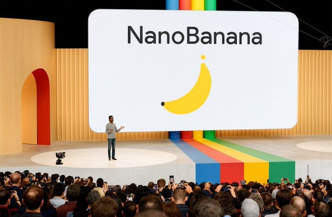

## 目录

- [✨ 画廊 (Showcase)](#-画廊-showcase)
- [🛠️ 如何使用 (How to Use)](#️-如何使用-how-to-use)
  - [API 调用示例](#api-调用示例)
  - [命令行工具](#命令行工具)
- [💡 应用场景 (Application Scenarios)](#-应用场景-application-scenarios)
- [📚 资源 & 工具 (Resources & Tools)](#-资源--工具)
- [🤝 如何贡献 (How to Contribute)](#-如何贡献-how-to-contribute)
- [📜 许可证 (License)](#-许可证-license)

## ✨ 画廊 (Showcase)

*在这里展示一些最惊艳、最有代表性的图片，用强烈的视觉冲击吸引访客。*

| 类别 | 提示语 (Prompt) | 生成结果 (Output) | 来源 |
| :--- | :--- | :--- | :--- |
| **手办模型** | `turn this photo into a character figure. Behind it, place a box with the character’s image printed on it, and a computer showing the Blender modeling process on its screen. In front of the box, add a round plastic base with the character figure standing on it. Make the PVC material look clear, and set the scene indoors if possible.` | ) | [西里森森
] |
| **产品渲染** | `A model is posing and leaning against a pink bmw. She is wearing the following items, the scene is against a light grey background. The green alien is a keychain and it's attached to the pink handbag. The model also has a pink parrot on her shoulder. There is a pug sitting next to her wearing a pink collar and gold headphones.` | 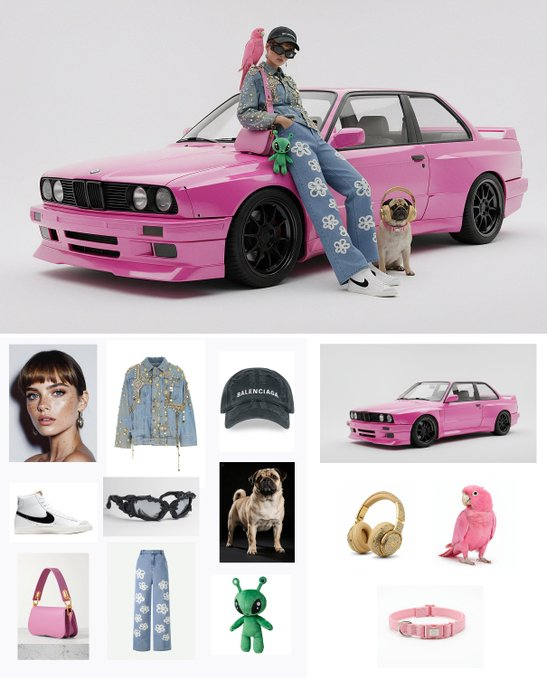  | [ravis Davids] |
| **虚实结合** | `what does the red arrow see` |  | [Eyisha Zyer] |
| **动作参考** | `make it real` |  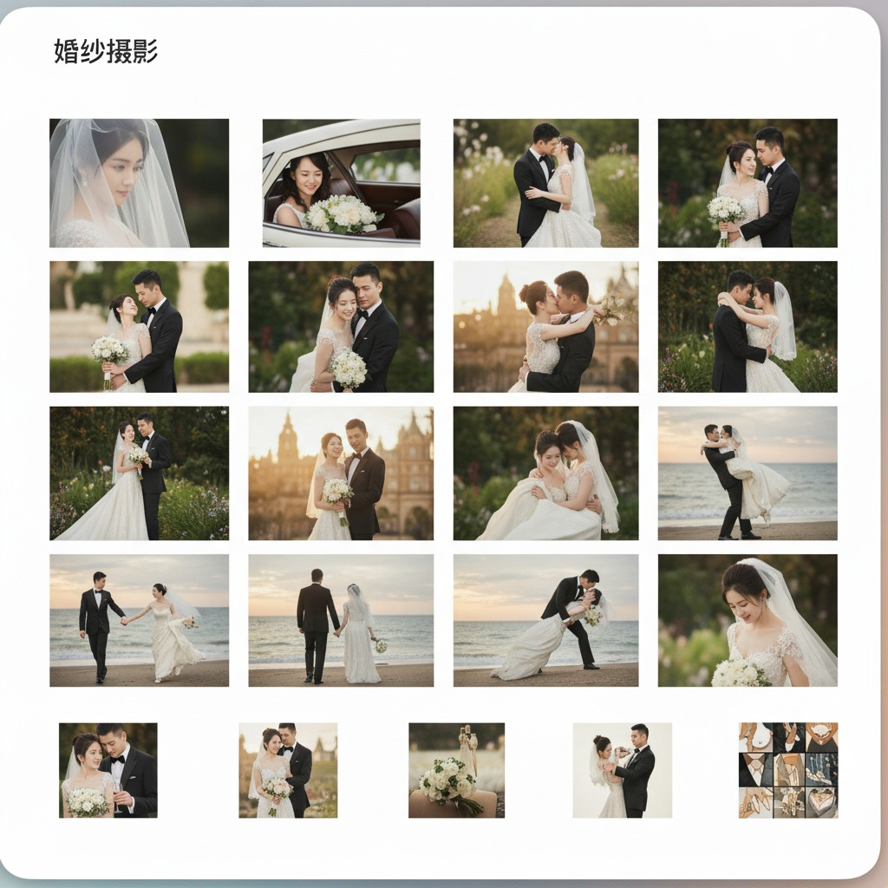| [nic] |


*(更多精彩案例请查看 [Showcase 目录](./showcase/))。*

## 💡 应用场景 (Application Scenarios)

**1. 场景融合 (Combine photos into new scenes)**
   - **说明**: 将多张独立的照片无缝融合成一个全新的、富有想象力的场景。例如，你可以把朋友的照片和一张月球表面的照片结合，生成一张“朋友在月球漫步”的图片，模型会自动处理光照、阴影和透视，让结果看起来天衣无缝。
   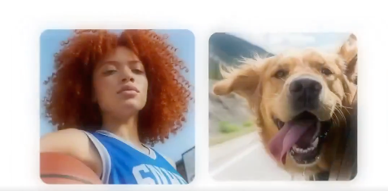 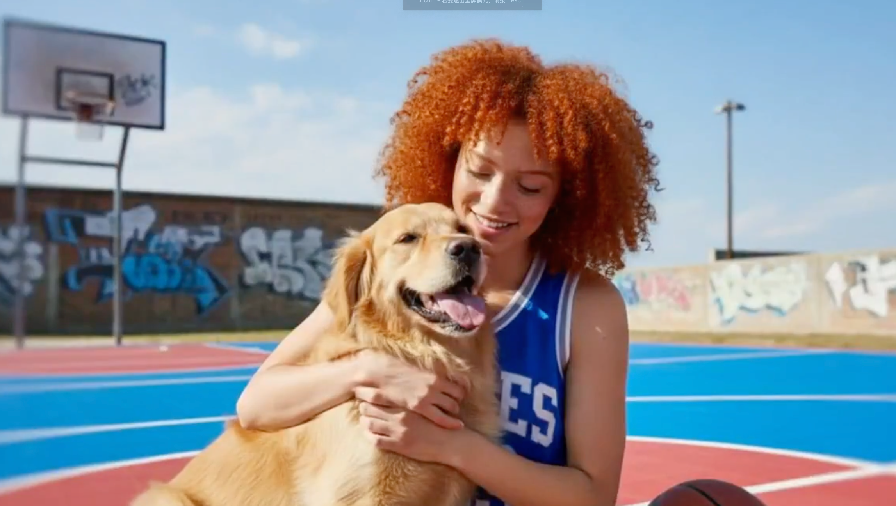
> 来源: [Eyisha Zyer]

**2. 描述式修图 (Edit image by describing to it)**
   - **说明**: 用自然语言直接“指挥”模型修改图片。不再需要复杂的P图软件，只需要告诉它“给这个女孩戴上一副墨镜”或者“把天空换成梵高星空的风格”，模型就能理解并执行你的指令。
   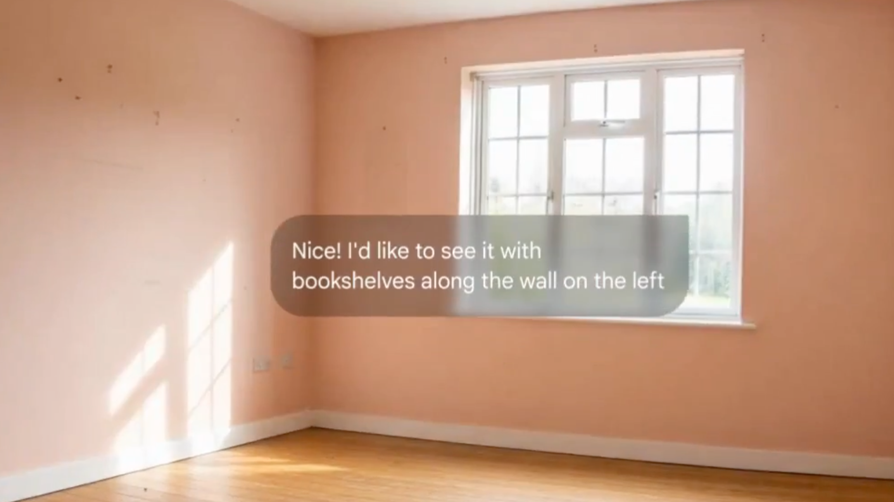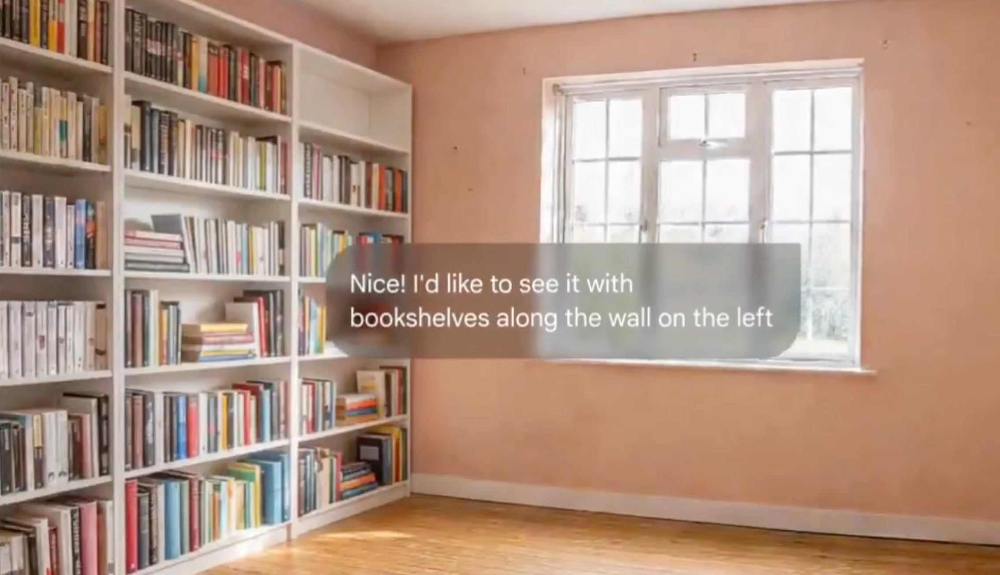
> 来源: [Eyisha Zyer]

**3. AI 视频流 (Nano Banana + Runway Act 2)**
   - **说明**: 这是一个强大的工作流。首先使用 Nano Banana 生成一张高质量的静态图片（例如，一个未来城市的关键帧），然后将其导入 Runway Act 2 等视频生成工具，让这张静态图片动起来，极大地简化了动画和视频的创作流程。
   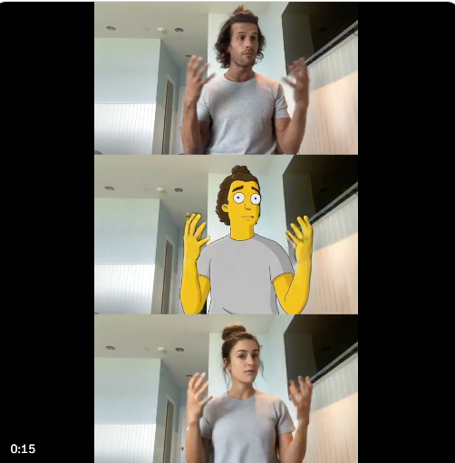
> 来源: [Techguyver]


**4. 广告概念帧 (Start frames for Ads)**
   - **说明**: 在广告制作初期，快速生成大量不同风格、不同创意的“起始帧”或“概念图”。这能帮助创意团队在几分钟内将想法可视化，进行提案和筛选，极大地提升了效率。
   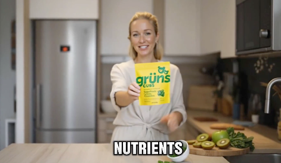
> 来源: [Mike Futia]

**5. 风格迁移 (Move styles from one image to another)**
   - **说明**: 将一张图片的艺术风格（如水彩、油画、赛博朋克）应用到另一张图片的内容上。你可以轻松地把一张普通的街景照片，变成一幅充满艺术感的杰作。
   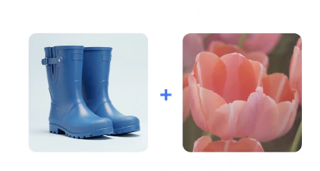 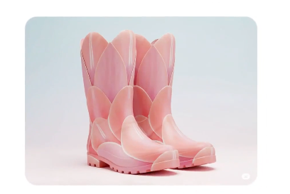
> 来源: [Eyisha Zyer]

**6. 图像内文字修改 (Change text)**
   - **说明**: 智能识别并修改图片中的文字内容。比如，你可以轻松地将一张海报上的“夏季大促”改成“秋季上新”，模型会自动匹配原有的字体、颜色和光照效果。
   
> 来源: [Eyisha Zyer]

**7. 老照片修复与增强 (Restore or fix old and blurry photos)**
   - **说明**: 修复有划痕、模糊不清或分辨率低的老旧照片。模型能够智能地“脑补”出缺失的细节，提升清晰度，甚至为黑白照片上色，让珍贵的回忆重焕新生。
   
> 来源: [请在此处插入来源]

**8. 智能背景替换 (Change image background)**
   - **说明**: 轻松更换任何图片的主体背景。无论是为证件照换底色，还是为产品图生成多样化的展示环境，都可以一键完成，并且边缘处理得非常自然。
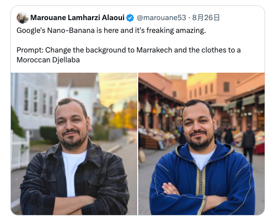
> 来源: [Marouane Lamharzi Alaoui]

**9. 独立动漫创作革命 (A new era of indie anime animators)**
   - **说明**: 为独立动画和漫画创作者赋能。通过生成角色设定、场景原画、关键帧动画等，大大降低了创作门槛和成本，让一个人或一个小团队也能创作出高质量的动漫作品。

> 来源: [tapehead.lab]

**10. 风格一致性创作 (Create new images in the same style from a reference photo)**
    - **说明**: 提供一张参考图片，让模型“学习”它的独特风格（包括画风、色调、笔触等），然后用这种风格生成全新的、不同内容的图片。这对于创作系列插画、游戏资产或保持品牌视觉一致性至关重要。
    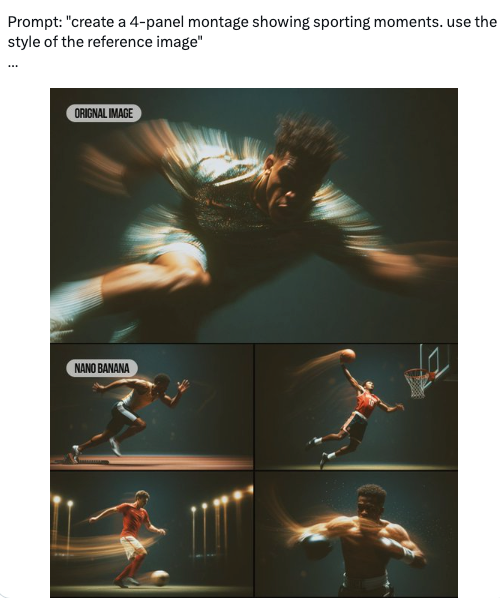
> 来源: [请在此处插入来源]

## 🛠️ 如何使用 (How to Use)

有两种主要方法可以体验 Gemini-Nano-Banana 的强大功能：

### 1. Gemini AI Studio (Chatbox 聊天框)

这是最简单快捷的方式，无需任何编程知识。

- **入口**: 访问 [Gemini AI Studio](https://aistudio.google.com/)
- **操作**:
  1. 在聊天框中直接输入你的图片生成指令 (Prompt)。
  2. 你也可以上传一张图片，然后输入指令让模型对图片进行编辑或变换。
  3. 点击生成，即可在界面右侧看到结果。

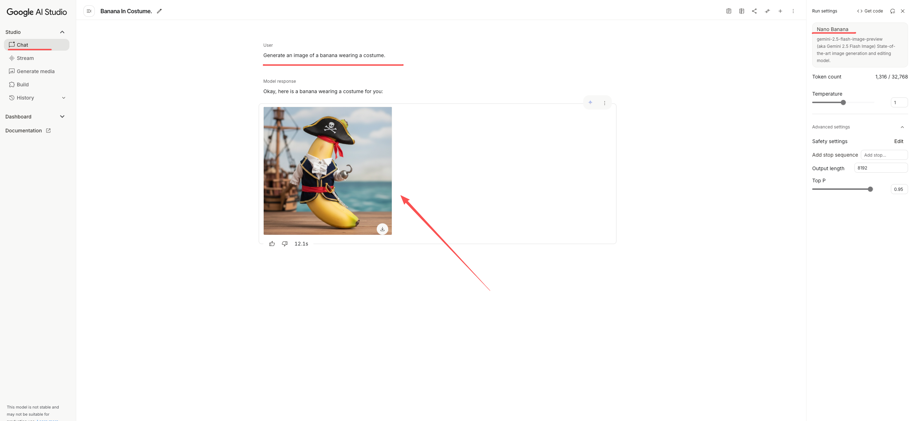

### 2. Google API 接入 (代码示例)

如果你是开发者，希望将模型能力集成到自己的应用中，可以使用 API。
https://github.com/nickylin/how-to-use-gemini-nano-banana

# To run this code you need to install the following dependencies:
# pip install google-genai
```
import base64
import mimetypes
import os
from google import genai
from google.genai import types


def save_binary_file(file_name, data):
    f = open(file_name, "wb")
    f.write(data)
    f.close()
    print(f"File saved to to: {file_name}")


def generate():
    client = genai.Client(
        api_key=os.environ.get("GEMINI_API_KEY"),
    )

    model = "gemini-2.5-flash-image-preview"
    contents = [
        types.Content(
            role="user",
            parts=[
                types.Part.from_text(text="""Generate an image of a banana wearing a costume."""),
            ],
        ),
        types.Content(
            role="model",
            parts=[
                types.Part.from_text(text="""Okay, here is a banana wearing a costume for you: """),
                types.Part.from_bytes(
                    mime_type="image/png",
                    data=base64.b64decode(
                        """base64image"""
                    ),
                ),
            ],
        ),
        types.Content(
            role="user",
            parts=[
                types.Part.from_text(text="""INSERT_INPUT_HERE"""),
            ],
        ),
    ]
    generate_content_config = types.GenerateContentConfig(
        response_modalities=[
            "IMAGE",
            "TEXT",
        ],
    )

    file_index = 0
    for chunk in client.models.generate_content_stream(
        model=model,
        contents=contents,
        config=generate_content_config,
    ):
        if (
            chunk.candidates is None
            or chunk.candidates[0].content is None
            or chunk.candidates[0].content.parts is None
        ):
            continue
        if chunk.candidates[0].content.parts[0].inline_data and chunk.candidates[0].content.parts[0].inline_data.data:
            file_name = f"ENTER_FILE_NAME_{file_index}"
            file_index += 1
            inline_data = chunk.candidates[0].content.parts[0].inline_data
            data_buffer = inline_data.data
            file_extension = mimetypes.guess_extension(inline_data.mime_type)
            save_binary_file(f"{file_name}{file_extension}", data_buffer)
        else:
            print(chunk.text)

if __name__ == "__main__":
    generate()
```

## 📚 资源 & 工具

*链接到所有相关的外部资源。*

- **官方文档**: [Gemini Nano Banana API Documentation]()
- **Demo**: [how-to-use-gemini-nano-banana](https://github.com/nickylin/how-to-use-gemini-nano-banana)

## 🤝 如何贡献 (How to Contribute)

我们非常欢迎社区的贡献！请参考我们的 [贡献指南](./CONTRIBUTING.md)。

## 📜 许可证 (License)

本项目采用 [MIT License](./LICENSE) 授权。